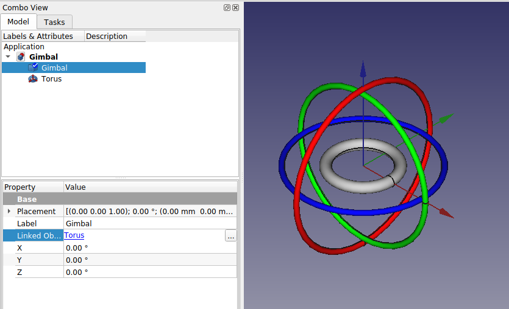

# FreeCAD Gimbal

[Gimbal](https://en.wikipedia.org/wiki/Gimbal) for visualizing [Euler (or Tait-Bryan) angles](https://en.wikipedia.org/wiki/Euler_angles) in FreeCAD.

A gimbal is a system of rotatable rings.

Gimbal rings are nested inside each other and parented from the inside-out.

The innermost ring rotates independently, while also being affected by the rings on the outside of it.

Each ring can only rotate on one axis.

The gimbal hierarchy is as follows:
* the outermost ring is the parent
* the middle ring is the child
* and the innermost ring is the grandchild.

The parent rotates the child, but the child does not rotate the parent.

In FreeCAD, this rotation order is x-y'-z" for *intrinsic* rotations, and z-y-x for *extrinsic* rotations (see [Tait-Bryan angle conventions](https://en.wikipedia.org/wiki/Euler_angles#Conventions)).

## Additional Information
* [The Rotation Problem](https://vimeo.com/2649637)
* [Euler (Gimbal Lock) Explained](https://www.youtube.com/watch?v=zc8b2Jo7mno&ab_channel=GuerrillaCG)
* [Understanding Gimbals & Gimbal Lock Solutions - 3D Animation Tutorial](https://www.youtube.com/watch?v=z3dDsz4f20A)
