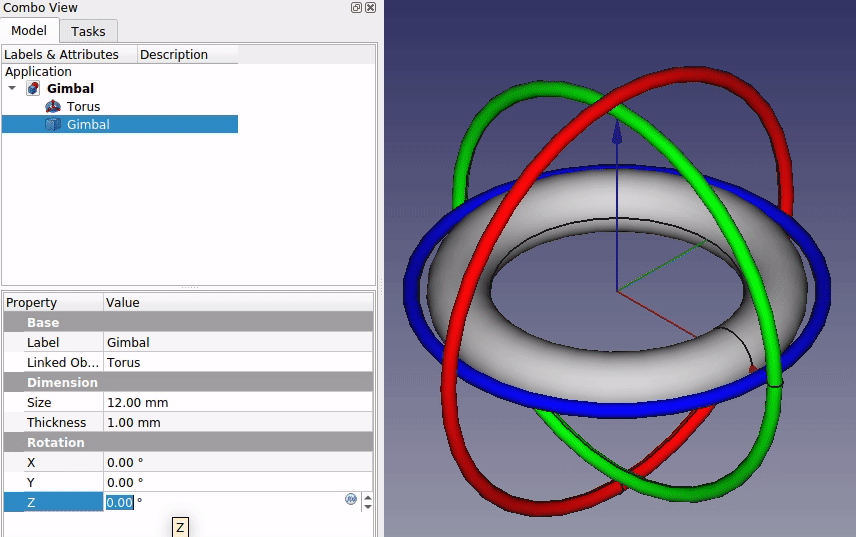

# FreeCAD Gimbal

[Gimbal](https://en.wikipedia.org/wiki/Gimbal) for visualizing [Euler (or Tait-Bryan) angles](https://en.wikipedia.org/wiki/Euler_angles) in FreeCAD.

A gimbal is a set of three hierarchical rotatable rings representing three possible axes of rotation, X, Y, or Z.

Different hierarchies of the rings, or rotation ordes can exist.

In FreeCAD, this rotation order is x-y'-z" for *intrinsic* rotations, and z-y-x for *extrinsic* rotations (see [Tait-Bryan angle conventions](https://en.wikipedia.org/wiki/Euler_angles#Conventions)).

The gimbal hierarchy is as follows:
* the outermost ring represents the X rotation axis, in red.
* the middle ring represents the Y rotation axis, in green.
* and the innermost represents the Z rotation axis, in blue.

Each ring is affected by the rings on the outside of it.

Thus, the X ring rotates independenty, the Y ring is affected by X, and the Z ring is affected by both X and Y rings.

## Additional Information
* [The Rotation Problem](https://vimeo.com/2649637)
* [Euler (Gimbal Lock) Explained](https://www.youtube.com/watch?v=zc8b2Jo7mno&ab_channel=GuerrillaCG)
* [Understanding Gimbals & Gimbal Lock Solutions - 3D Animation Tutorial](https://www.youtube.com/watch?v=z3dDsz4f20A)
